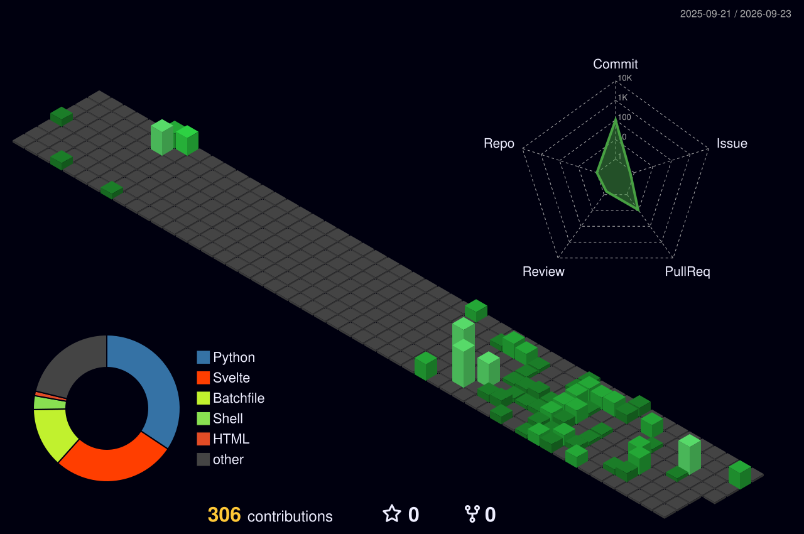

<div align="center">


[](https://git.io/typing-svg)

</div>

---

## About Me

```yaml
name: Shafaat
alias: twistedvortek
role: IT Infrastructure & Operations Specialist
certifications:
  - AWS Certified Solutions Architect (SAA-C03) 2025-2028
  - Cisco Certified Network Associate (CCNA) 2025-2028
education: BSc (Hons) Computing - Liverpool John Moores University
languages: [English, Hindi, Urdu]
passions:
  - IT Infrastructure & Operations
  - Networking & Systems Administration
  - Self-Hosted Homelab Projects
  - Cloud & Virtualisation
fun_fact: "I told my homelab it was just for gaming. It now runs 15 services and has more uptime than me."
```

---

## Tools & Technologies

<div align="center">

**Networking & Infrastructure**


**Cloud & Virtualisation**


**Monitoring & DevOps**


**Productivity & Collaboration**


</div>

---

## Featured Project - Self-Hosted Homelab

> **Gaming PC -> Production-Grade Homelab Server** | 2016 - Present

```
Proxmox VE Hypervisor
├── TrueNAS SCALE -> 44TB RAID-Z1 Storage Pool (10TB usable)
├── Docker LXC -> 15 Self-Hosted Microservices
│   ├── Nextcloud (File Sync), Immich (Photo Backup)
│   ├── Nginx Proxy Manager + Let's Encrypt SSL
│   ├── Grafana + Prometheus (Infrastructure Monitoring)
│   ├── Pterodactyl (Game Server Management)
│   └── Discord Bot (Python + MongoDB)
├── Tailscale VPN -> Secure Remote Access
└── GitHub Actions -> CI/CD Zero-Downtime Deployments
```

---

## GitHub Stats

<div align="center">

[](https://git.io/awesome-stats-card)


</div>

---

## 3D Commit Activity

<div align="center">



</div>

---

## Typing Speed

<div align="center">


[](https://monkeytype.com/profile/kinetixtactic)

</div>

---

## GitHub Trophies

<div align="center">

[](https://github.com/ryo-ma/github-profile-trophy)

</div>

---

## Activity Graph

<div align="center">

[](https://github.com/ashutosh00710/github-readme-activity-graph)

</div>

---

## Connect With Me

<div align="center">

[](https://linkedin.com/in/shafaatahmed)
[](https://shafaat.net)
[](https://twitter.com/whoisshafaat)
[](https://github.com/twistedvortek)

---


</div>


